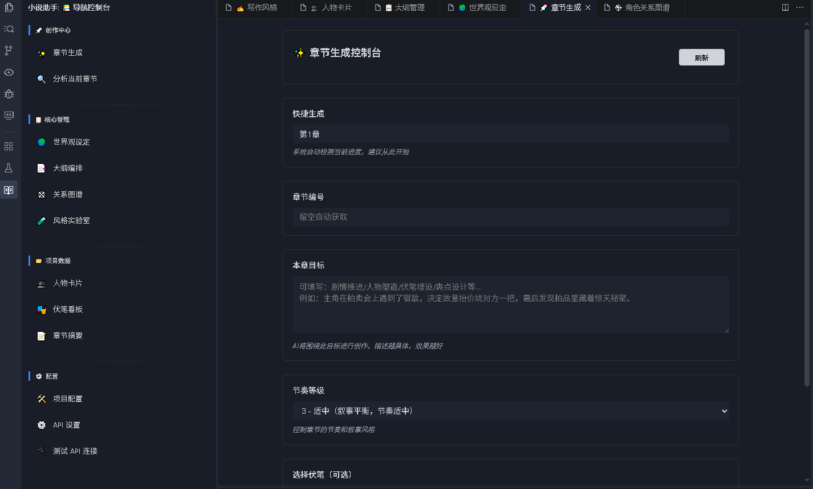
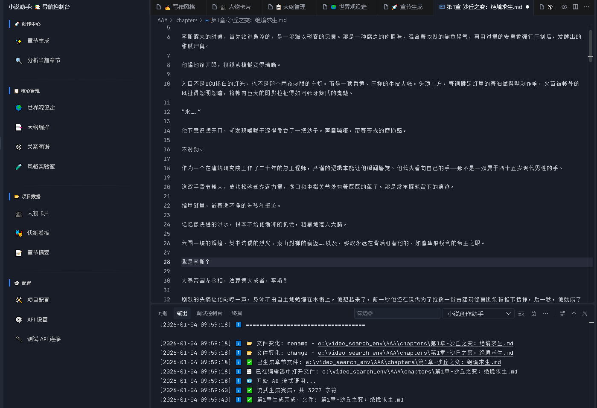
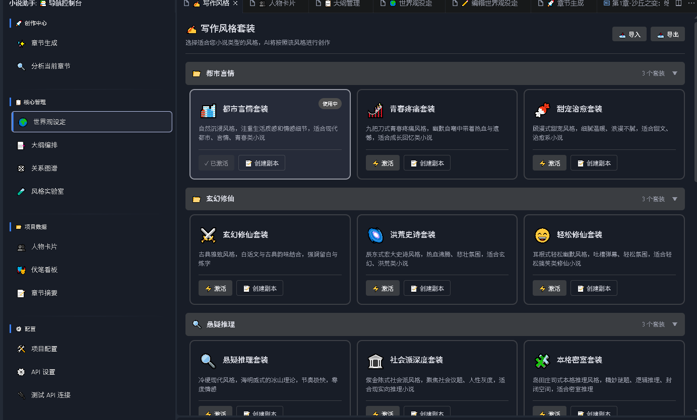

# 小说创作助手

 基于AI的小说创作辅助插件。

官网： https://waqupin.com/

## 截图

以下为插件界面示例：

特色详解

本节详细说明插件中若干核心子系统及其使用场景，方便在 Marketplace 详情页“功能/细节”处展示。

- 长篇记忆能力
	- 描述：插件维护跨章节、跨项目的持久记忆，能够把重要人物信息、事件线、世界观设定以结构化形式存储并在生成或分析时检索使用。
	- 特点：支持分层记忆（全局 / 项目 / 章节）、记忆摘录与权重标注，可对旧章节的关键信息进行检索并作为上下文注入到 AI 提示中，减少重复设定并增强内容连贯性。
	- 场景：长篇连载、系列作品、需要长期伏笔与人物成长追踪的项目。

- 性格系统（人物配置与弧线）
	- 描述：为每个角色维护详尽的性格档案（姓名、别名、身份、性格标签、动机、成长目标等）。
	- 特点：支持角色状态的“前后”对比（章节前/后），自动记录心理变化与关键事件，提供可视化人物关系与冲突列表。
	- 场景：构建复杂人物关系网、推进人物成长弧线、生成符合人物设定的对白与行为。

- 节奏等级系统（Pacing Levels）
	- 描述：内置“节奏等级”评估器，用以衡量章节或段落的速度感与张弛对比。
	- 特点：输出节奏评分、指出过快/过慢位置并给出调整建议（补充细节或删减冗余），支持“节奏优化”精修模板一键应用。
	- 场景：控制阅读体验、强化高潮、避免平铺直叙或信息堆叠。

- 伏笔系统（Planting & Resolving）
	- 描述：用于标注、追踪和管理故事中的伏笔（已埋/已解/未解），支持关键字索引与重要性评分。
	- 特点：自动从文本中提取可能的伏笔候选，提供“埋伏笔提醒”和“伏笔冲突检测”，在章节生成时推荐与伏笔相关的衔接句或线索补充。
	- 场景：悬疑、长篇推理、连载小说的节奏管理与悬念维护。

- 风格实验室 & 作家风格模板
	- 描述：内置丰富的写作风格套装，可选择不同“知名作家风格”模板（风格为示例性模板，非原作者授权的逐字复制），并支持用户自定义和套装化管理。
	- 特点：每个风格包含核心指令、优先关注点和示例片段；支持组合多个风格、设置偏好参数，并在生成时注入风格规则以减少“AI味”。
	- 场景：快速尝试不同笔触、风格迁移、统一章节风格或模仿特定风格进行创作练习。

- 文章精修系统
	- 描述：基于模板的精修管线，用户可选择系统模板或自定义模板，对章节进行局部或全文精修。
	- 特点：要求直接输出修改后的完整文本，并用统一格式标注修改点（例如：【修改】原文 → 新文（原因：xxx））；同时返回统计信息（字数变化、修改次数、估计耗时）。
	- 场景：稿件润色、语言质量提升、重点段落强化、连载稿件的批量精校。

主要功能

- 章节生成：根据世界观、人物和大纲自动生成章节草稿。
- 章节分析：对当前章节进行结构、伏笔、人物弧线等多维度分析。
- 文章精修：应用内置和自定义精修模板对章节进行自动精校与优化。
- 世界观与人物管理：管理角色卡片、世界观设定、伏笔等项目数据。
- 风格实验室：预设写作风格与自定义风格套装，支持一键应用。
- 激活验证：本地激活码验证系统，用于控制功能访问（开发者可配置）。
- API 测试：内置“测试 API 连接”命令，帮助用户验证其 AI 服务配置是否可用。

快速开始

1. 安装插件并打开侧栏的“小说助手”。
2. 打开 `设置` → 搜索 `novelAssistant`，配置 `novelAssistant.apiKey`、`novelAssistant.apiBase`、`novelAssistant.model`。
3. 在侧栏使用“章节生成”或“精修”功能开始创作。

配置（请记住，任何一款工具都不能直接帮你赚钱，你需要给AI注入灵魂，AI只是工具，AI只是工具，AI只是工具）
本系统支持几乎所有外部API 基础创作可以用国内的大模型，满足创作需求。如果你想真正意义上的实现AI创作赚钱，必须辅助顶级AI，不要迷信国内大模型，国内大模型只能提供基础创作，无法满足AI创作赚钱的需求。市面上正真实现AI创作赚钱的，都是使用顶级AI。当然无论使用什么大模型都是需要你人工注入灵魂的，用国内的就多修改，用国外的就少修改，也只是人工参与的多少而已。实测的一篇5000字的费用国内基本免费，阿里千问免费的基本用不完，DeepSeek的10块钱也够你生成百万字了.国外的高级模型5000字费用在1毛左右,我的建议是先用你国内免费的,测试写作方向和风格，然后在使用国外的高级模型，毕竟国外的高级模型才是AI创作赚钱的主力。(有任何疑问可以咨询我，我会尽力解答)
- `novelAssistant.apiKey`：外部 AI 服务的 API Key。
- `novelAssistant.apiBase`：API 基础 URL（如 OpenAI 或其他服务的基础端点）。
- `novelAssistant.model`：使用的模型名称。

## 🔐 隐私与安全

**打包和发布安全**：
- ✅ 用户的敏感信息仅存储在本地 VS Code 设置中
- ✅ 本系统只调用外部 AI 服务，不存储任何用户数据
- ✅ 所有信息都由用户自主控制

**更多信息**：
- 详见 [API_SECURITY_GUIDE.md](./API_SECURITY_GUIDE.md) 了解安全最佳实践
- 详见 [RELEASE_CHECKLIST.md](./RELEASE_CHECKLIST.md) 了解安全发布流程

如需更多使用帮助，请查看项目中的 docs/ 目录。

